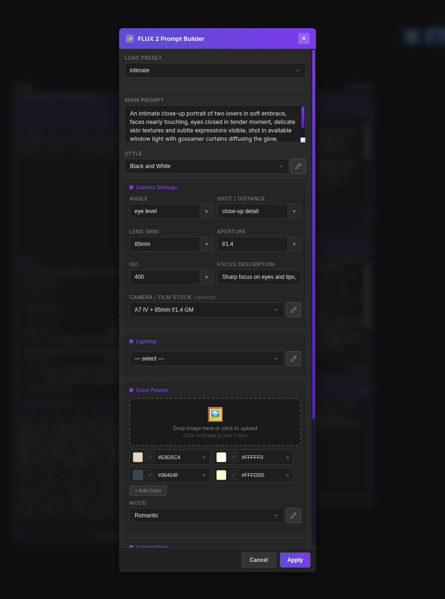
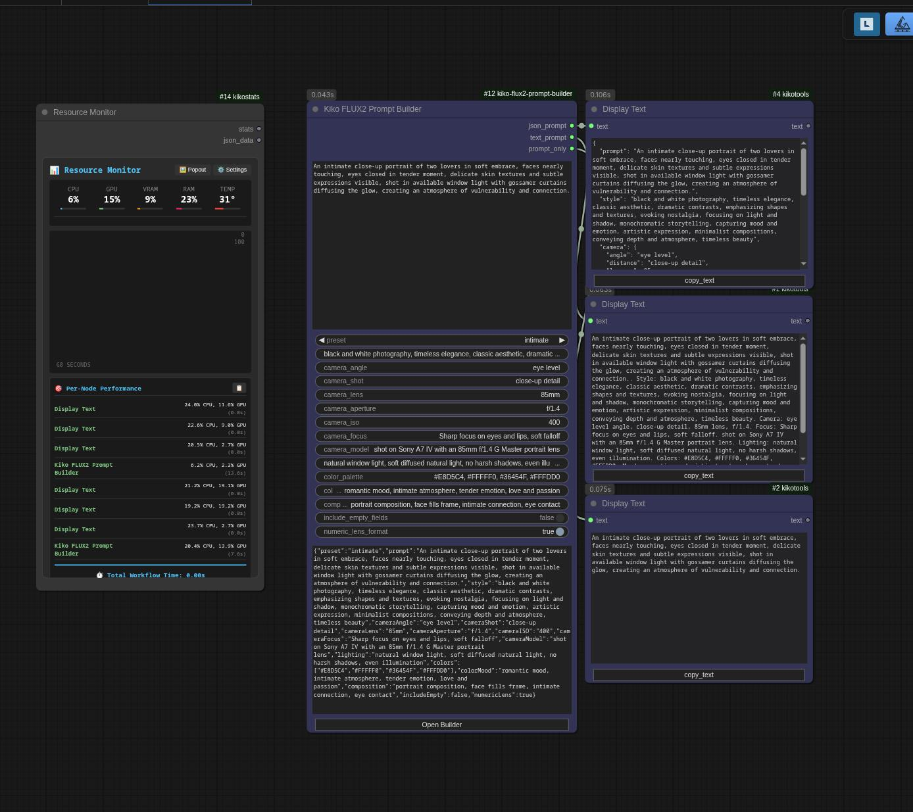

# 🎨 Kiko Prompt Builder

A visual prompt builder [ComfyUI](https://www.comfy.org/) custom node for structured JSON prompt generation. Build photography-style prompts with camera settings, lighting, composition, and color palettes.

**Compatible with:** [FLUX](https://bfl.ai/) (by Black Forest Labs), [z-image](https://z-image.ai/), and any other image generation model that accepts structured JSON prompts.






## ✨ Features

- **20+ Photography Presets**: Intimate portraits, landscapes, street photography, product shots, architectural, wildlife, and more
- **Complete Camera Settings**: Angle, shot distance, lens focal length, aperture, ISO, focus description
- **Camera/Film Stock Database**: Authentic camera models and film stocks for realistic rendering
- **Professional Lighting Presets**: Natural light, studio setups, dramatic/cinematic options
- **Composition Guidelines**: Rule of thirds, golden ratio, leading lines, symmetrical, and more
- **Color Palette Builder**: Visual color swatches with hex support
- **Mood Presets**: Emotional tones and visual aesthetics
- **Dual Output**: Structured JSON and flattened text prompt formats
- **Context Menu**: Quick preset access, copy JSON, reset to defaults

## 🔌 Model Compatibility

This node outputs structured JSON and flattened text prompts compatible with:

| Model | Compatibility | Notes |
|-------|---------------|-------|
| **[FLUX](https://bfl.ai/)** | ✅ Full | Primary target; supports all JSON fields |
| **[z-image](https://z-image.ai/)** | ✅ Full | Supports structured JSON prompts |
| **Other JSON models** | ✅ Varies | Any model accepting JSON prompt format |
| **Standard CLIP** | ✅ Text output | Use `text_prompt` output for CLIP encoders |

## 📦 Installation

### Method 1: ComfyUI Manager (Recommended)
1. Open ComfyUI Manager
2. Search for "Kiko FLUX2 Prompt Builder"
3. Click Install

### Method 2: Manual Installation
```bash
cd ComfyUI/custom_nodes
git clone https://github.com/ComfyAssets/kiko-flux2-prompt-builder.git
# Restart ComfyUI
```

### Method 3: Download ZIP
1. Download the latest release
2. Extract to `ComfyUI/custom_nodes/kiko-flux2-prompt-builder`
3. Restart ComfyUI

## 🚀 Usage

1. **Add the node**: Right-click → Add Node → 🎨 Kiko → Prompting → FLUX2 Prompt Builder
2. **Select a preset** or build from scratch
3. **Customize** camera settings, lighting, colors, and composition
4. **Connect outputs** to your workflow:
   - `json_prompt` → Advanced workflows requiring structured data
   - `text_prompt` → Standard CLIP text encoder
   - `prompt_only` → Just the main scene description

## 📤 Outputs

### JSON Prompt
Structured JSON perfect for advanced workflows:
```json
{
  "prompt": "A weathered fisherman...",
  "style": "documentary photography...",
  "camera": {
    "angle": "eye level",
    "distance": "medium close-up",
    "lens-mm": 85,
    "f-number": "f/1.8",
    "ISO": 200,
    "focus": "Sharp focus on eyes"
  },
  "film_stock": "shot on Canon EOS 5D Mark IV...",
  "lighting": "golden hour lighting...",
  "colors": {
    "palette": ["#8B4513", "#4169E1", "#B0C4DE"],
    "mood": "moody atmosphere..."
  },
  "composition": "rule of thirds"
}
```

### Text Prompt
Flattened text for standard CLIP encoding:
```
A weathered fisherman... Style: documentary photography... Camera: eye level angle, medium close-up, 85mm lens, f/1.8. Shot on Canon EOS 5D Mark IV... Lighting: golden hour lighting... Colors: #8B4513, #4169E1, #B0C4DE. Mood: moody atmosphere... Composition: rule of thirds.
```

## 🎬 Presets

| Category | Presets |
|----------|---------|
| **People & Portraits** | Intimate, Boudoir, Fashion, Portrait |
| **Nature & Outdoors** | Landscape, Wildlife, Macro, Underwater, Astro |
| **Action & Events** | Sports, Street, Theatrical, Culinary |
| **Commercial** | Product, Automotive, Architectural |
| **Artistic** | Cinematic, Vintage, Minimalist |

## 📷 Camera Settings

| Setting | Options |
|---------|---------|
| **Angle** | Eye level, Low/High angle, Bird's-eye, Dutch, Over-the-shoulder |
| **Shot** | Extreme close-up to Ultra wide, Macro, Action shots |
| **Lens** | 14mm - 400mm, Macro, Fisheye, Tilt-shift |
| **Aperture** | f/1.2 - f/16 |
| **ISO** | 100 - 6400 |

## 🔧 Development

### Project Structure
```
kiko-flux2-prompt-builder/
├── __init__.py              # ComfyUI entry point
├── nodes/
│   ├── __init__.py
│   └── prompt_builder_node.py
├── web/js/
│   ├── kikoPromptBuilder.js # Frontend extension
│   └── data/                # JSON preset data
├── app/                     # Standalone MVP (reference)
├── pyproject.toml
└── requirements.txt
```

### Building from Source
```bash
# Clone the repository
git clone https://github.com/ComfyAssets/kiko-flux2-prompt-builder.git
cd kiko-flux2-prompt-builder

# Link to ComfyUI
ln -s $(pwd) /path/to/ComfyUI/custom_nodes/kiko-flux2-prompt-builder

# Install dev dependencies (optional)
pip install -e ".[dev]"

# Run tests
pytest -v
```

## 🤝 Contributing

Contributions welcome! Feel free to:
- Add new presets
- Improve the UI
- Add new features
- Report bugs
- Submit pull requests

## 📄 License

MIT License - Feel free to use, modify, and distribute.

## 🙏 Acknowledgments

- [ComfyUI](https://www.comfy.org/) - The powerful node-based workflow platform
- [Black Forest Labs](https://bfl.ai/) - Creators of the FLUX family of image generation models
- All contributors and users

---

*Built with ❤️ for the AI art community by [ComfyAssets](https://github.com/ComfyAssets)*
